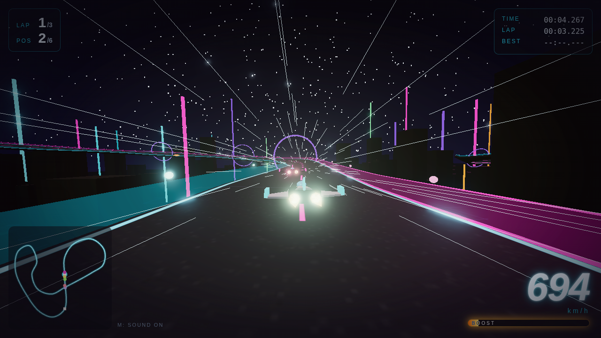

# NEON VELOCITY

ブラウザで動く、Ace Speeder / F-ZERO / WipEout 系の **超高速 3D アンチグラビティ・レースゲーム** です。
Three.js + Vite 製で、アセットファイルは一切使わず、コース・車体・背景・サウンドをすべてコードから生成しています。



## 遊び方

```bash
npm install
npm run dev      # http://localhost:5173 を開く
```

| 操作 | キーボード | ゲームパッド |
| --- | --- | --- |
| アクセル | `W` / `↑` | RT / A |
| ブレーキ | `S` / `↓` | LT / B |
| ステアリング | `A` `D` / `←` `→` | 左スティック |
| ブースト | `Shift` / `Space` | X / RB |
| リスタート | `R` | – |
| ポーズ | `P` / `Esc` | – |
| ミュート | `M` | – |

- 3 周で勝負。AI 5 機と 6 台のレースです。
- 路面のオレンジ矢印は **ブーストパッド**。踏むと加速し、ブーストゲージが回復します。
- ブーストゲージはブースト中に減り、非使用時にゆっくり回復します。
- コーナーでは遠心力で外側に流されるので、内側へ切り込むのがコツ。壁に強くぶつかると大きく減速します。

## Android / スマホで遊ぶ

PWA (Progressive Web App) 対応なので、アプリストア不要で Android の Chrome からそのまま遊べます。

1. GitHub Pages などで公開した URL を Android の Chrome で開く (ローカルなら `npm run dev -- --host` で LAN 内のスマホからアクセス可能)。
2. 画面をタップするとレース開始。同時にフルスクリーン化と横画面ロックを要求します。
3. Chrome のメニューから「ホーム画面に追加」すると、アイコンから全画面アプリとして起動でき、オフラインでも動作します。

タッチ操作 (横画面):

| 位置 | 操作 |
| --- | --- |
| 左下のパッド | 左右にタッチ / スライドでステアリング (中心からの距離で舵角が変わります) |
| 右下 ACCEL | アクセル (タッチ端末では自動加速なので通常は不要) |
| 右下 BRAKE | ブレーキ (押している間は自動加速も止まります) |
| 右下 BOOST | ブースト |
| 上部 ⏸ / TILT / 🔊 | ポーズ / 端末を傾けて操作するモードの切替 / ミュート |

スマホでは解像度と Bloom の負荷を自動的に下げ、バックグラウンドに回ると自動でポーズします。Bluetooth ゲームパッドにも対応しています。

## 技術メモ

| ファイル | 内容 |
| --- | --- |
| `src/track.js` | Catmull-Rom スプラインから閉じたコースを生成。曲率に応じたバンク、路面・エナジーウォール・ブーストパッド・ライトのメッシュ生成、ミニマップ用データ |
| `src/vehicle.js` | 機体の物理 (コース座標系 `s` / 横位置 `lat` で管理)。加速・ドラッグ・遠心力・壁の反発とグラインド・ブースト。機体メッシュもここで生成 |
| `src/ai.js` | 対戦 AI。先読み曲率で減速、インコース取り、ブーストパッド狙い、回避、ラバーバンド |
| `src/effects.js` | スピードライン、加算合成のスパーク・パーティクル |
| `src/scenery.js` | スカイドーム、星、グリッド地面、ビル群、ネオンタワー、コース上のリング |
| `src/hud.js` | 速度・ラップ・順位・タイム・ブーストゲージ・ミニマップ・リザルト |
| `src/audio.js` | Web Audio による手続き型エンジン音 / 効果音 |
| `src/main.js` | レンダラ (ACES + Bloom)、固定ステップ (120 Hz) の物理ループ、追従カメラ、レース進行、タッチ UI / フルスクリーン / Service Worker 登録 |
| `src/input.js` | キーボード・ゲームパッド・タッチ (マルチタッチ対応) ・傾きセンサーの入力統合 |
| `public/manifest.webmanifest`, `public/sw.js` | PWA マニフェストとオフライン用 Service Worker |

- 物理は 120 Hz 固定ステップ、描画はフレームレート非依存。
- 車体はコースに沿った 1 次元座標 `s` と横方向オフセット `lat` で動かし、ワールド座標はスプラインのフレームから復元しています。カーブでは `κ·v²` に比例した遠心力が横方向に働きます。
- `window.__game.advance(sec)` でシミュレーションを決定論的に進められるので、ヘッドレスブラウザでのテストにも使えます。

## ビルド / デプロイ

```bash
npm run build    # dist/ に静的ファイルを出力
npm run preview  # ビルド結果を確認
```

`.github/workflows/deploy.yml` により、`main` へ push すると GitHub Pages に自動デプロイされます (リポジトリ設定で Pages の Source を "GitHub Actions" にしてください)。
